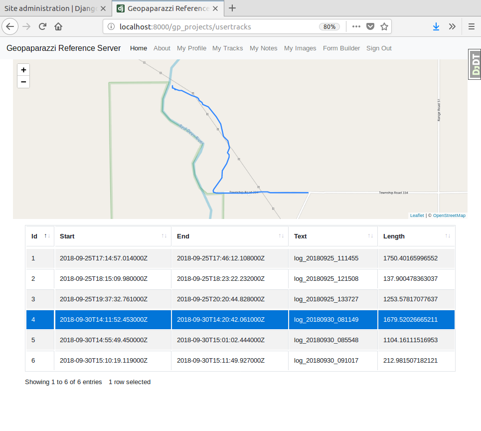
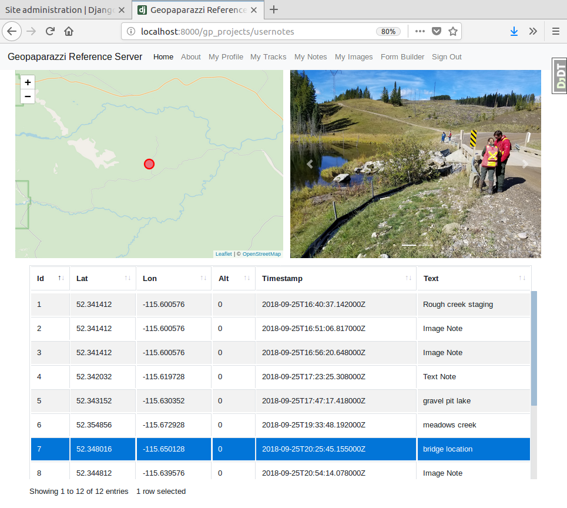
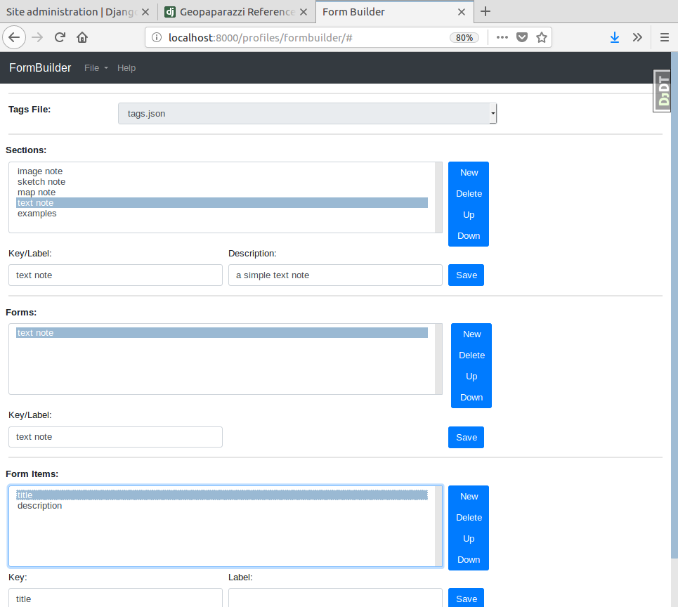
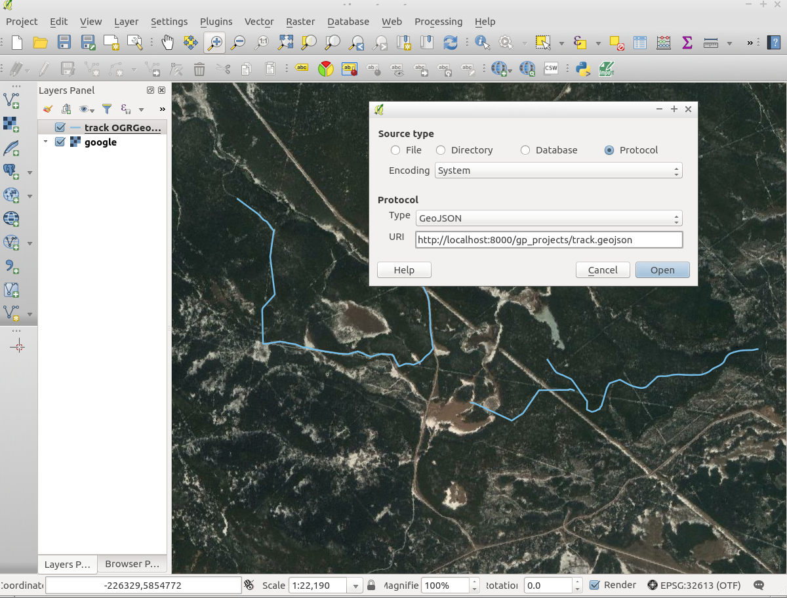
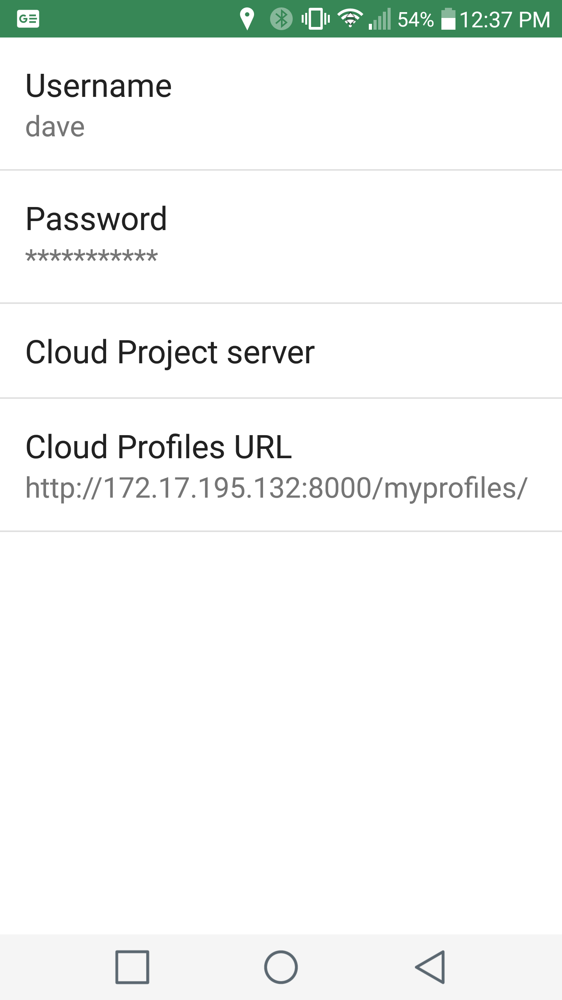

In two [previous](https://geoanalytic.github.io/a-reference-server-for-geopaparazzi-cloud-profiles/) [posts](https://geoanalytic.github.io/a-reference-server-for-geopaparazzi-cloud-profiles-part-2/), I described how to set up a local instance of a server for [Geopaparazzi](https://github.com/geopaparazzi/geopaparazzi) cloud profiles.  The result was a Django server with a PostGIS database that provided a set of RESTful endpoints to allow users to upload and download the various files associated with [Geopaparazzi cloud profiles](http://geopaparazzi.github.io/geopaparazzi/#_geopaparazzi_cloud_server).      

At the time, the server offered the minimum amount of functionality to support cloud profiles - namely storing and serving the various basemaps, forms, and other files to the app.  Since then, we have added some useful capabilities that I hope others will find useful, including:    

## map and image views for uploaded tracks and notes     

     

The functionality on these pages is all client based, written as Django templates accessing the REST API.  This should make it easy for developers to choose their preferred framework.   

    

## a tool for building Geopaparazzi Forms (tags.json type files)    

    

## asynchronous processing of uploaded user projects    

## geoJSON feeds of spatial data    

    

In this post, I'll briefly describe how to set up the server on a local machine and demonstrate how to develop new functionality.   

# Setting Up For Development    

As described in the [origninal post](https://geoanalytic.github.io/a-reference-server-for-geopaparazzi-cloud-profiles/), the system is built using [docker-compose](https://docs.docker.com/compose/) and [cookiecutter](https://cookiecutter.readthedocs.io/en/latest/).  This makes it really easy to get up and running with the potential to move to a full production server when you are ready.  Here are the steps required to get a local version of the server running:    

1.  Install cookiecutter    

```
$ pip install "cookiecutter>=1.4.0"
```

2.  Run it against the latest repo for the reference server     

```
$ cookiecutter https://github.com/geoanalytic/cookiecutter-geopaparazzi-server
```

You will be asked a number of questions, some of which are only applicable to production systems.  For development purposes, you should enter 'y' to the following choices (these should be the defaults):    

* docker    
* celery    
* whitenoise    

If you are using Windows, you will need to do some extra stuff:    


3) CD into the directory created by the cookiecutter process and then build and run the containers:    

```
$ cd geopaparazzi_reference_server
$ docker-compose -f local.yml build
$ docker-compose -f local.yml up -d
$ docker-compose -f local.yml ps
```

If everything is working, the last command should result in a report like this:    

```
                    Name                                  Command               State           Ports         
--------------------------------------------------------------------------------------------------------------
geopaparazzi_reference_server_celerybeat_1     /entrypoint /start-celerybeat    Up                            
geopaparazzi_reference_server_celeryworker_1   /entrypoint /start-celeryw ...   Up                            
geopaparazzi_reference_server_django_1         /entrypoint /start               Up      0.0.0.0:8000->8000/tcp
geopaparazzi_reference_server_flower_1         /entrypoint /start-flower        Up      0.0.0.0:5555->5555/tcp
geopaparazzi_reference_server_postgres_1       /bin/sh -c /docker-entrypo ...   Up      5432/tcp              
geopaparazzi_reference_server_redis_1          docker-entrypoint.sh redis ...   Up      6379/tcp  
```

What you see is six containers running within an isolated network that allows the containers to communicate among themselves.  Only the django and flower containers are open to outside connections.  Each container does one thing:   

* django ... provides the python based web framework 
* postgres ... provides a PostgreSQL/PostGIS database   
* redis ... provides a message broker and in memory cache for performance and to support celery tasks    
* celeryworker ... provides an on demand asysnchronous processing capability     
* celerybeat ... provides scheduled background processing capability    
* flower ... provides a real-time monitoring tool for the celery tasks    

4) Get the database and static assets set up, create a superuser        

```
$ docker-compose -f local.yml run --rm django python manage.py collectstatic    
$ docker-compose -f local.yml run --rm django python manage.py createsuperuser    
```

The second command will prompt you to enter a username, email and password for the superuser.  You will need those credentials to access the system so write them down!    


5)  Now load the demo data     

Download the demo data from [here](https://drive.google.com/open?id=12HwGhqdFNvZwS5Y6iO1dC81HWZQbsPnu).  Note that you need to install [Httpie](https://httpie.org/) and edit the load_local.sh file, replacing `user:password` with the values you provided for the superuser and your server IP address for the `uploadurl` entries.     

```
$ cd location/of/demo/data
$ ./load_local.sh
```

Next, point your browser at http://localhost:8000/admin, login with your superuser credentials and edit the Profiles and create Profilesets for your superuser as described in the [original post](https://geoanalytic.github.io/a-reference-server-for-geopaparazzi-cloud-profiles/).    

6)  Connect Geopaparazzi to your server    

 You will need to figure out the IP address of the computer the server is running on.  On Linux, use the command `hostname -I`.  On Windows, the command `ipconfig` should work.  On your mobile, start the app and select the settings (gear) icon, then select Cloud Server Settings and fill in the user, password and Cloud Profiles URL as shown:    

{:height="25%" width="25%"}   

7)  Download the cloud profiles
# What Now?     


